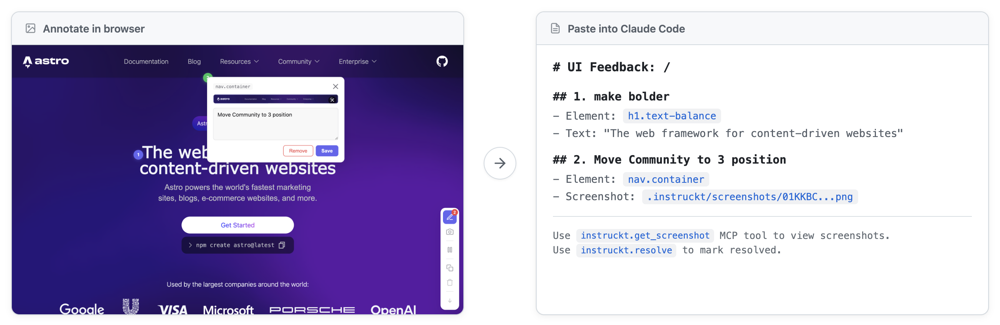

# instruckt-astro

Visual annotation feedback for AI coding agents in Astro. Click on any UI element, leave feedback with optional screenshots, and let AI agents read and fix issues.



## Installation

```bash
bun add -D instruckt-astro
# or: npm install -D instruckt-astro
# or: pnpm add -D instruckt-astro
```

Add the integration to your Astro config:

```typescript
// astro.config.mjs
import { defineConfig } from 'astro/config';
import instruckt from 'instruckt-astro';

export default defineConfig({
  integrations: [instruckt()]
});
```

Add MCP server to your project's `.mcp.json`:

```json
{
  "mcpServers": {
    "instruckt": {
      "command": "npx",
      "args": ["instruckt-mcp"],
      "cwd": "/absolute/path/to/project"
    }
  }
}
```

Add `.instruckt/` to your `.gitignore`:

```
.instruckt/
```

## Usage

1. Run your Astro dev server
2. Press `A` to enter annotation mode, click any element to annotate
3. Press `C` to capture a region screenshot
4. Annotations are auto-copied as markdown - paste into Claude Code
5. Claude can view screenshots and mark issues resolved via MCP

## MCP Tools

Claude Code (or any MCP client) can use these tools to interact with annotations:

- `instruckt_get_all_pending` - Get all pending annotations
- `instruckt_get_screenshot` - Get base64-encoded screenshot for an annotation
- `instruckt_resolve` - Mark an annotation as resolved

## Dev Toolbar

The integration adds an app to Astro's dev toolbar showing pending annotations. Click the chat bubble icon to view all annotations and navigate to annotated pages.

## Configuration

All options are optional. The defaults work for most projects:

```typescript
instruckt({
  enabled: true,                    // Default: true in dev, false in prod
  endpoint: '/api/instruckt',       // Custom API prefix
  position: 'bottom-right',         // Toolbar position
  theme: 'auto',                    // auto | light | dark
  adapters: ['vue', 'react'],       // Framework detection
  colors: {
    default: '#6366f1',             // Marker color
    screenshot: '#22c55e',          // Marker with screenshot
    dismissed: '#71717a'            // Dismissed marker
  },
  keys: {
    annotate: 'a',
    freeze: 'f',
    screenshot: 'c',
    clearPage: 'x'
  }
})
```

## API Endpoints

The integration exposes REST endpoints for custom integrations:

- `GET /api/instruckt/annotations` - List all annotations
- `POST /api/instruckt/annotations` - Create annotation
- `PATCH /api/instruckt/annotations/[id]` - Update annotation status
- `GET /api/instruckt/screenshots/[filename]` - Get screenshot image

## Development

Contributing to instruckt-astro:

```bash
bun install
bun run build       # Build package
bun run test        # Run unit tests
bun run test:e2e    # Run E2E tests
bun run test:all    # Run all tests
```

## Requirements

- Astro 5.x (adapter auto-configured)

## Credits

This package is an Astro port of [instruckt-laravel](https://github.com/joshcirre/instruckt-laravel) by [Josh Cirre](https://github.com/joshcirre). It uses the [instruckt](https://github.com/joshcirre/instruckt) frontend library for the visual annotation UI.

## License

MIT
